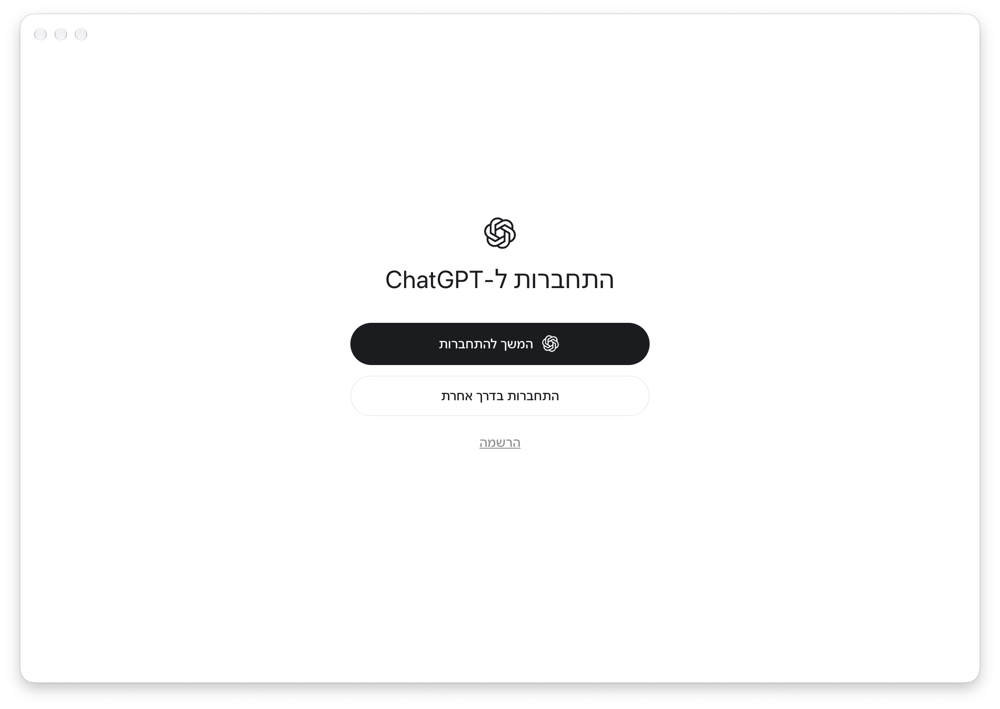

# ChatGPT eBrew

התאמה קהילתית ולא רשמית של ChatGPT Desktop לעברית ולתצוגה מימין לשמאל. הפרויקט ניסיוני ונבדק ב־macOS עם Apple Silicon; תמיכה ב־Windows עדיין אינה מאומתת.

זהו עותק עברי הפיך של ChatGPT Desktop. המעטפת אינה משנה את `/Applications/ChatGPT.app` או את הפרופיל הרגיל. היא מתקינה יישום נפרד וחתום מקומית בשם `~/Applications/צ׳אט ג׳יפיטי בעברית.app`, עם פרופיל נפרד וממשק בעברית.

## התקנה

1. פתחו את [עמוד ההורדות](https://github.com/Quegenx/codex-rtl/releases).
2. ב־Mac עם Apple Silicon ו־macOS 13 ומעלה הורידו את `ChatGPT-eBrew-macOS-arm64.dmg`.
3. פתחו את הקובץ, הפעילו את **Install ChatGPT eBrew** ולחצו **Install**.

נדרשת גרסת ChatGPT Desktop `26.901.51231`, המותקנת ב־`/Applications/ChatGPT.app`. המתקין כולל את התרגומים ואת כל הדרוש להתאמה; אין צורך ב־Git, ב־Bun, ב־Python, במפתח API או בקובץ הגדרות. ייתכן שתידרש התחברות מחדש בפרופיל הנפרד.

המתקין הניסיוני חתום מקומית ואינו מאושר ב־Apple Notarization. macOS עשוי לחסום את הפתיחה; אם אתם סומכים על ההורדה, ניתן לאשר אותה ב־**System Settings → Privacy & Security → Open Anyway**. לא נבדקה פתיחה לאחר הורדה במחשב Mac נקי.

**Windows:** עדיין אין מתקין נתמך. נדרשים יישום Windows תואם ובדיקת התקנה והרצה במחשב Windows לפני פרסום הורדה עבורו.

לבניית המתקין מקוד המקור ראו [הוראות למפתחים](docs/BUILD_INSTALLERS.md).

## שימוש ועדכונים

לאחר ההתקנה, פתחו את **צ׳אט ג׳יפיטי בעברית** מתוך תיקיית היישומים שלכם. התרגומים מצורפים למוצר ומוכנים לשימוש.

הפרופיל הנפרד נשמר ב־`~/Library/Application Support/ChatGPT Hebrew/`. כדי לחזור ליישום הרגיל, פתחו את ChatGPT המקורי; הפרופיל הרגיל אינו משתנה.

האפליקציה המקורית ב־`/Applications/ChatGPT.app` ממשיכה לקבל עדכונים מ־OpenAI כרגיל. העותק העברי אינו מפעיל את מנגנון העדכון הרשמי, מפני שעדכון כזה יחליף את הקבצים המותאמים. לאחר שיוצאת גרסת ChatGPT חדשה, העותק העברי הקיים נשאר בגרסתו הקודמת. כאשר מתפרסם מתקין eBrew שתומך בגרסה החדשה, סגרו את היישום העברי והריצו אותו. המתקין שומר את הפרופיל ואת ההגדרות הקיימות, ומסרב לשנות את ההתקנה כאשר גרסת ChatGPT המקורית אינה תואמת.

ההתאמה תלויה בגרסת ChatGPT הנתמכת. ב־macOS חלק מהתפריטים שייכים למערכת ההפעלה ועשויים להישאר בשפת המערכת. תמיכה ב־Windows ובכל המסכים והמצבים עדיין אינה מאומתת.

## רישיון

קוד הפרויקט מופץ ברישיון [MIT](LICENSE). שמות, סימנים מסחריים, נכסי צד שלישי וחומר שמקורו ביישום ChatGPT אינם נכללים ברישיון; ראו [NOTICE](NOTICE.md).
